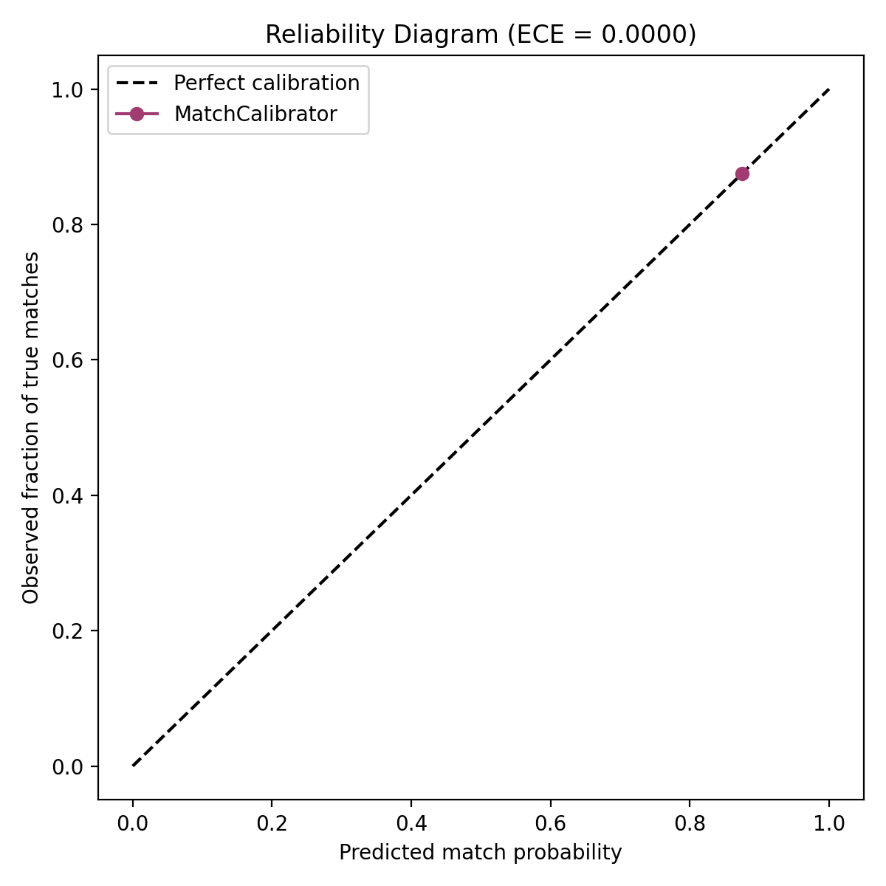

# Calibration Report

> **Note:** generated from **real, human-confirmed data** exported from the Neon DB via `export_labelled_pairs.py` (8 labelled pairs: 7 confirmed matches, 1 confirmed rejections). **Small sample (8 pairs)** -- treat as early/illustrative until more confirmed handovers and rejections have accumulated.

## Method

Composite scores from `fusion.composite_score()` are fit with
`calibration.MatchCalibrator` (Platt scaling / logistic regression on the
single composite-score feature), then binned into 10 buckets to compare
predicted probability against observed match rate.

## Results

- **Expected Calibration Error (ECE): 0.0000** (0 = perfectly calibrated)
- P(match | raw_score=0.2) = 0.857
- P(match | raw_score=0.5) = 0.869
- P(match | raw_score=0.85) = 0.883
- n = 8 pairs (7 positive, 1 negative)

The closer the calibration curve sits to the diagonal, the more an "X%
match probability" shown to a student actually corresponds to X% of
such matches being correct.
