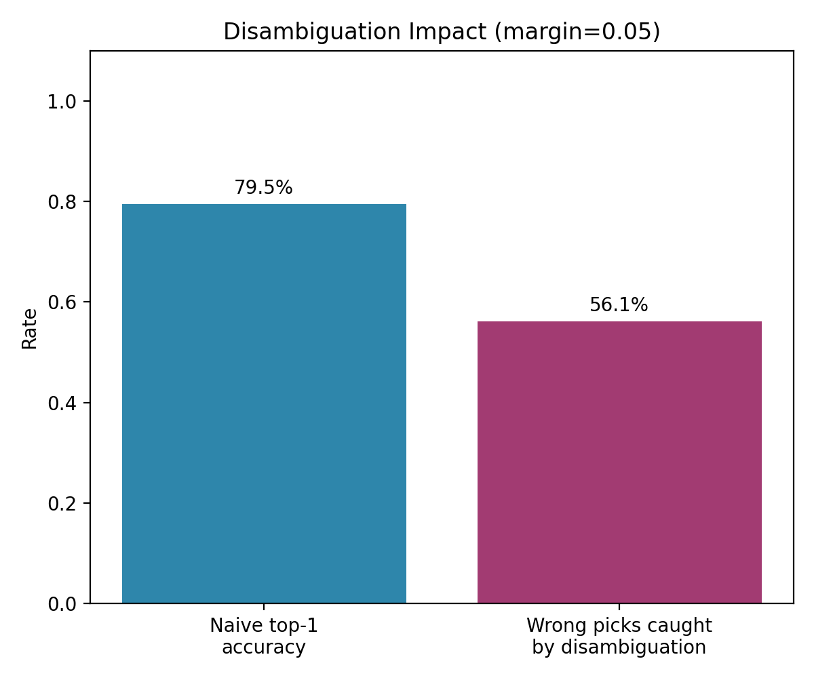

# Disambiguation Impact

> **Note:** this one is always a simulation, even when you pass `--csv` -- measuring "how often would naive top-1 have been silently wrong" needs many repeated randomized lost-vs-multiple-found scenarios, which your real confirmed-match data won't have volume for yet. Uses `fusion.competing_cluster()` (real code) against simulated candidate sets.

## Method

Simulates 200 "one lost report vs several found candidates"
scenarios with one true match each. Compares silently auto-picking the
top-scoring candidate against flagging it for a follow-up question when
`fusion.competing_cluster()` finds >= 2 candidates within `margin=0.05`
of the top score.

## Results

- Naive top-1 accuracy (no disambiguation): **79.5%**
- Of the naive top-1's wrong picks, disambiguation flagged **56.1%**
  of them for a follow-up question instead of silently committing to the
  wrong candidate.
- Total scenarios flagged for disambiguation: 47/200

