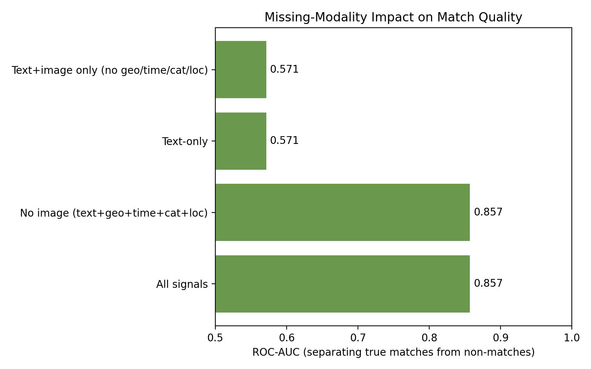

# Missing-Modality Impact

> **Note:** generated from **real, human-confirmed data** exported from the Neon DB via `export_labelled_pairs.py` (8 labelled pairs: 7 confirmed matches, 1 confirmed rejections). **Small sample (8 pairs)** -- treat as early/illustrative until more confirmed handovers and rejections have accumulated.

## Method

The same labelled pairs are scored with `fusion.composite_score()` under
different available-signal scenarios (fusion.py auto-redistributes weights
over whatever signals are present), then ROC-AUC measures how well each
scenario separates true matches from non-matches.

## Results

| Scenario | ROC-AUC |
|---|---|
| All signals | 0.857 |
| No image (text+geo+time+cat+loc) | 0.857 |
| Text-only | 0.571 |
| Text+image only (no geo/time/cat/loc) | 0.571 |

This quantifies the value of each modality: how much match quality drops
when a report is filed without a photo (common for e.g. a lost ID card
found by someone else), versus having the full six-signal fusion.
