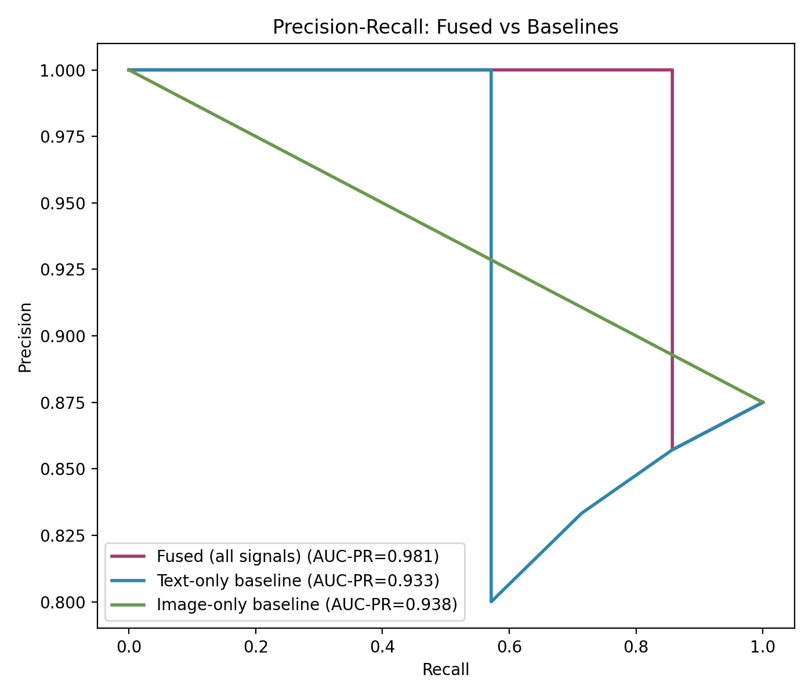

# Precision / Recall vs Baselines

> **Note:** generated from **real, human-confirmed data** exported from the Neon DB via `export_labelled_pairs.py` (8 labelled pairs: 7 confirmed matches, 1 confirmed rejections). **Small sample (8 pairs)** -- treat as early/illustrative until more confirmed handovers and rejections have accumulated.

## Method

For each labelled pair, three scores are computed with the same real
`fusion.composite_score()` function, restricted to different signal subsets:
fused (all six signals, weights auto-redistributed for missing ones),
text-only, and image-only. Precision-recall curves are computed by sweeping
the match threshold across each score.

## Results

| Method | AUC-PR |
|---|---|
| Fused (all signals) | 0.981 |
| Text-only baseline | 0.933 |
| Image-only baseline | 0.938 |

n = 8 pairs (7 positive, 1 negative).
